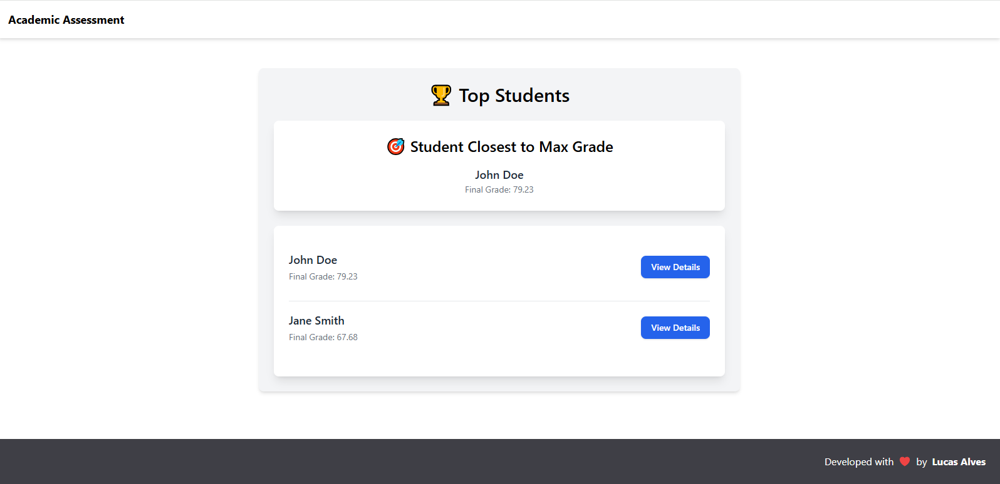

## 🧮 Introdução

Este projeto é um sistema de avaliação de desempenho acadêmico que calcula as notas dos alunos com base em diferentes critérios e mantém um histórico mensal das notas.

## 💻 Tecnologias

As principais tecnologias utilizadas no projeto são:

### Backend

- **Ruby on Rails** 🛤️
- **PostgreSQL** 🐘
- **RSpec** 🔍
- **Swagger** 📑 (Para documentação da API)

### Frontend

- **React.js** ⚛️
- **TypeScript** 💻
- **TailwindCSS** 🎨
- **Jest + RTL** 🧪
- **Storybook** 📖 (Para documentação interativa dos componentes)

### Outros
- **Docker** 🐋

## 🧑‍💻 Versões Utilizadas
- **Ruby**: 3.3.0 🦋
- **Rails**: 7.2.2.1 🛤️
- **Node.js**: 21.7.3 🌐
- **React.js**: 19.0.0 ⚛️
- **TypeScript**: 4.4.2 💻

## 🛠️ Setup
Para começar, copie o arquivo `.env.example` para `.env` e altere os valores das variáveis de ambiente conforme necessário.
Nota: Para executar os testes no Docker, ajuste para utilizar o `env.test`.

## 🧑‍💻 Arquitetura
Aqui está uma visão da arquitetura do sistema, utilizando **Clean Architecture**:

## 📖 Documentação da API
A documentação da API pode ser acessada através do seguinte endpoint (caso implementada):
- **Swagger**: [http://localhost:3000/api-docs](http://localhost:3000/api-docs) 📄 (Opcional)

## 📖 Documentação do Frontend
A documentação do frontend foi criada utilizando o **Storybook** para visualizar os componentes e suas interações,
acesse a documentação interativa dos componentes no seguinte endereço:
- **Storybook**: [http://localhost:6006](http://localhost:6006) 📚

## 🖥️ Tela do Sistema
Aqui está uma captura da tela do sistema:

